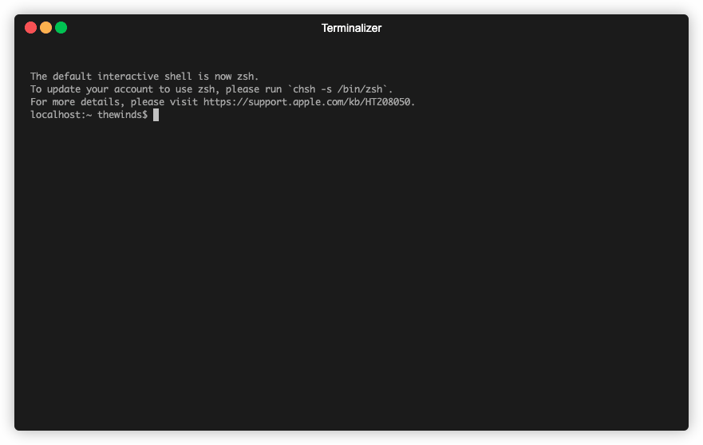

# devgo
> a command-line launcher



## Install

### latest version
```shell script
curl -o- https://raw.githubusercontent.com/TheWinds/devgo/main/install.sh | bash
```

### special version
```shell script
curl -o- https://raw.githubusercontent.com/TheWinds/devgo/main/install.sh | bash -s 1.0.0
```

## QuickStart
```shell script
dg
```

## Hotkeys
* select group `←` `→`
* select item  `↑` `↓`
* search item `type keywords`
* exit `ctrl+c` `ctrl+d` `esc`

## Config

If you don't have any configuration, the toml configuration file will be created automatically. You can also create your own yaml configuration file, which can be read better. You can only choose one of them.

> file path: ~/.devgo.toml
```toml
# random group tab name preifx emoji
tab_emojis="🐶🐱🐭🦊🐻🐼🐮🐷🐸🐵🦉🦄🐟🐳🐖🐂💥🌈🌞"
mode="easy"

[[group]]
# group name
name="tools"
[[group.item]]
# group item title
title="hello"
# group item command to exec
exec="echo hello devgo"
[[group.item]]
title="date now"
exec="date"

[[group]]
name="website"
[[group.item]]
title="github"
exec="open https://github.com"

[[group]]
name="devgo"
[[group.item]]
title="edit config"
exec="vim $HOME/.devgo"
```

> file Path: ~/.devgo.yaml
```yaml
tab_emojis: "🐶🐱🐭🦊🐻🐼🐮🐷🐸🐵🦉🦄🐟🐳🐖🐂💥🌈🌞"
mode: "vim" #`vim` or `easy`

group:
  -
    name: "tools"
    item:
      - { title: "hello", exec: "echo hello devgo" }
      - { title: "date now", exec: "date" }
  -
    name: "website"
    item:
      - { title: "github", exec: "open https://github.com" }

  -
    name: "devgo"
    item:
      - { title: "edit config", exec: "vim $HOME/.devgo.yaml" }
```

## Uninstall
```shell script
rm $(which dg)
```

## Vim Mode
Not mature enough at present, not recommended.

Inspiration from [vimium](https://chrome.google.com/webstore/detail/vimium/dbepggeogbaibhgnhhndojpepiihcmeb?hl=en)

- [x] `h` `j` `k` `l`: Equivalent to `←` `↑` `↓` `→`
- [x] `i`: Edit `~/.devgo.yaml`
- [x] `/`: Enter search mode
- [ ] `n` `N`:  Cycle forward to the next find match 
- [ ] `gg` `G`: Back to top and bottom
- [ ] `u` `d`: Up or down 5 positions
- [ ] `x`: Exit
- [ ] `f`: Show all command shortcut key
- [ ] `?`: Show help
- [ ] `H` `L`: Go to the first or last group 
- [ ] `r`: Try the last command again